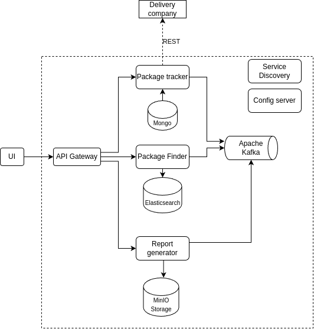

# PIS

**Table of contents:**
* [Project overview](#project-overview)
* [App setup](#app-setup)
* [Start project](#start-project)
  * [Tutorials](#tutorials)

## Project overview
This repository is for a microservices-based Parcel Tracking System. It allows clients to add and track shipments using their identifier. 
The system integrates with various carriers to locate the specific shipment. It features storing tracking history in a local database and periodically checks for status updates on saved shipments. 
The system offers full-text search functionality across all shipment attributes and enables printing of the tracking history, with files being stored in a separate resource.

## Architecture

